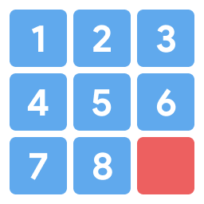

# 8-Puzzle

The 8-Puzzle is a problem consisting of sliding tiles one-by-one either **up**, **down**, **left**, or **right** to reach the final goal state shown below.

<p align="center">
  
</p>

The **red** tile above can be swapped with any one of its neighboring tiles, **not** including its diagonal neighbors. Each swap counts as a move, and the result of a swap creates a new state if it was not seen before.

## How to Run
First, clone this repository and navigate to its directory in the terminal.

The driver code is located in `main.py`, so the program can be executed by doing:
```
python3 main.py
```