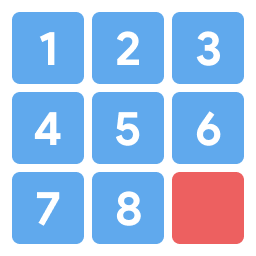

# 8-Puzzle

The 8-Puzzle is a problem consisting of sliding tiles one-by-one either **up**, **down**, **left**, or **right** to reach the final goal state shown below.

<p align="center">
  
</p>

The **red** tile above can be swapped with any one of its neighboring tiles, **not** including its diagonal neighbors. Each swap counts as a move, and the result of a swap creates a new state if it was not seen before.

## How to Run
First, clone this repository and navigate to its directory in the terminal.

The driver code is located in `main.py`, so the program can be executed by doing:
```
python3 main.py
```

Afterwards, you will be prompted in the command line to either select a default puzzle or enter your own puzzle, and select which type of search algorithm to perform.

## Output
A sample output of the program is shown below, for when the user chooses to select a *Default Puzzle*, the *Medium* level puzzle, and *A\* search with the Euclidean distance heuristic*.

*Note: some parts of the output are hidden with "..."*.
```
Type "1" to use a default puzzle, or "2" to enter your own puzzle.
1
Choose one of the default puzzles below.
(1) Solved
1 2 3
4 5 6
7 8 0

(2) Easy
1 2 3
4 5 6
7 0 8

(3) Medium
0 5 2
1 8 3
4 7 6

(4) Hard
0 8 1
6 7 2
5 4 3

(5) Oh Boy
8 7 1
6 0 2
5 4 3

Enter your selection: 3
Enter your choice of algorithm.
(1) Uniform Cost Search
(2) A* with the Misplaced Tile heuristic
(3) A* with the Euclidean distance heuristic
3
Searching with A* Euclidean distance...

Expanding state
0 5 2
1 8 3
4 7 6

The best state to expand with g(n) = 0 and h(n) = 8.0 is...
0 5 2
1 8 3
4 7 6
Expanding this node...

The best state to expand with g(n) = 1 and h(n) = 7.0 is...
1 5 2
0 8 3
4 7 6
Expanding this node...

...

The best state to expand with g(n) = 7 and h(n) = 1.0 is...
1 2 3
4 5 0
7 8 6
Expanding this node...

Goal!!!

To solve this problem the search algorithm expanded a total of 8 nodes.
The maximum number of nodes in the queue at any one time: 8.

Solution path is...

1 5 2
0 8 3
4 7 6

1 5 2
4 8 3
0 7 6

...

1 2 3
4 5 0
7 8 6

1 2 3
4 5 6
7 8 0

Program completed in 0.00220489501953125 seconds.
```

## Search Algorithms
When running the program, you're given the option to select 3 different options to search by, described below.

### Uniform Cost Search
This search method prioritizes nodes with the cheapest total path cost (depth) and expand them.

### A* Search with Misplaced Tiles Heuristic
A* search also takes into account how close a given state is to the goal state, measured by the heuristic function. The heuristic here is counting the total number of misplaced tiles by comparing a given state to the goal state. Less misplaced tiles means the state is closer to the goal.

### A* Search with Euclidean Distance Heuristic
Here, the heuristic function is measuring the total distance between each tile in a node to the goal state by calculating the Euclidean distance. In other words, for each tile number in a state, the Euclidean distance is computed using the tile's current position to where the tile **should** be in the goal state.